# 播放列表播放时序图

下面是 player 命令播放某个播放列表的时序图，展示了从用户输入命令到播放结束的完整流程。

```mermaid
sequenceDiagram
    title 播放列表播放时序图
    
    participant User as 用户
    participant CLI as player/cli.py
    participant Player as player/player.py
    participant Playlist as playlist/playlist.py
    participant Auth as auth/auth.py
    participant API as api/api.py
    participant VLC as VLC实例
    participant Network as 网络请求
    
    User->>CLI: dupan-music player play <playlist_name>
    activate CLI
    
    Note over CLI: play_playlist函数
    
    CLI->>Auth: 获取认证实例
    activate Auth
    Auth-->>CLI: BaiduPanAuth实例
    deactivate Auth
    
    CLI->>Auth: auth.is_authenticated()
    activate Auth
    Auth-->>CLI: 认证状态
    deactivate Auth
    
    CLI->>API: 创建API实例(auth)
    activate API
    API-->>CLI: BaiduPanAPI实例
    deactivate API
    
    CLI->>Playlist: 创建PlaylistManager(api)
    activate Playlist
    Playlist-->>CLI: PlaylistManager实例
    deactivate Playlist
    
    CLI->>Player: 创建AudioPlayer(api, playlist_manager)
    activate Player
    Player->>VLC: 初始化VLC实例
    VLC-->>Player: VLC实例
    Player-->>CLI: AudioPlayer实例
    deactivate Player
    
    CLI->>Playlist: playlist_manager.get_playlist(playlist_name)
    activate Playlist
    Note over Playlist: 从本地文件加载播放列表
    Playlist-->>CLI: Playlist实例
    deactivate Playlist
    
    CLI->>Player: audio_player.set_playlist(playlist)
    activate Player
    Player->>Player: 停止当前播放
    Player->>Player: 设置当前播放列表
    Player-->>CLI: 设置结果
    deactivate Player
    
    CLI->>Player: audio_player.play(index)
    activate Player
    
    Player->>Player: 停止当前播放
    Player->>Player: 设置当前索引和项目
    
    Player->>Playlist: _check_file_validity(current_item)
    activate Playlist
    Playlist->>API: api.get_file_info([fs_id])
    activate API
    API-->>Playlist: 文件信息
    deactivate API
    Playlist-->>Player: 文件有效性
    deactivate Playlist
    
    alt 文件无效
        Player->>Playlist: _refresh_file(current_item)
        activate Playlist
        Playlist->>API: api.get_file_info([fs_id])
        activate API
        API-->>Playlist: 刷新的文件信息
        deactivate API
        Playlist-->>Player: 刷新后的PlaylistItem
        deactivate Playlist
    end
    
    Player->>API: _download_file(current_item)
    activate API
    API->>API: api.get_download_link(item.fs_id)
    API->>Network: 发送下载请求
    activate Network
    Network-->>API: 文件数据
    deactivate Network
    API-->>Player: 临时文件路径
    deactivate API
    
    Player->>VLC: 创建媒体(temp_file)
    activate VLC
    VLC-->>Player: 媒体实例
    deactivate VLC
    
    Player->>VLC: player.play()
    activate VLC
    VLC-->>Player: 播放结果
    deactivate VLC
    
    alt 播放成功
        Player->>Playlist: playlist_manager.add_to_recent_playlist(current_item.to_dict())
        activate Playlist
        Playlist->>Playlist: 更新最近播放列表
        Playlist-->>Player: 添加结果
        deactivate Playlist
        
        Player->>Player: _start_event_thread()
        Note over Player: 启动事件线程监控播放状态
        
        Player->>CLI: 调用on_play_callback
        Player-->>CLI: 播放成功
    else 播放失败
        Player-->>CLI: 播放失败
    end
    deactivate Player
    
    CLI->>CLI: 显示播放控制界面
    CLI->>CLI: 监听用户按键
    
    loop 播放过程中
        CLI->>Player: 获取播放状态
        activate Player
        Player-->>CLI: 播放状态
        deactivate Player
        
        alt 用户按键
            User->>CLI: 按键操作
            
            alt 空格键
                CLI->>Player: player.pause()
                activate Player
                Player->>VLC: 暂停/恢复播放
                VLC-->>Player: 操作结果
                Player-->>CLI: 暂停/恢复结果
                deactivate Player
            else n键
                CLI->>Player: player.next()
                activate Player
                Player->>Player: 计算下一曲索引
                Player->>Player: play(next_index)
                Player-->>CLI: 下一曲结果
                deactivate Player
            else p键
                CLI->>Player: player.prev()
                activate Player
                Player->>Player: 计算上一曲索引
                Player->>Player: play(prev_index)
                Player-->>CLI: 上一曲结果
                deactivate Player
            else +键
                CLI->>Player: player.set_volume(current_volume + 5)
                activate Player
                Player->>VLC: 设置音量
                VLC-->>Player: 操作结果
                Player-->>CLI: 设置音量结果
                deactivate Player
            else -键
                CLI->>Player: player.set_volume(current_volume - 5)
                activate Player
                Player->>VLC: 设置音量
                VLC-->>Player: 操作结果
                Player-->>CLI: 设置音量结果
                deactivate Player
            else q键
                CLI->>Player: player.stop()
                activate Player
                Player->>VLC: 停止播放
                VLC-->>Player: 操作结果
                Player->>Player: _clean_temp_file()
                Player-->>CLI: 停止结果
                deactivate Player
                CLI-->>User: 退出播放
            end
        end
        
        alt 播放结束
            Player->>Player: 检测到播放结束
            Player->>Player: 调用on_complete_callback
            Player->>Player: next()
            activate Player
            Player->>Player: 播放下一曲
            deactivate Player
        end
    end
    
    deactivate CLI
```

## 时序图说明

这个时序图展示了以下关键流程：

1. **命令行交互**：用户通过 `dupan-music player play <playlist_name>` 命令触发播放列表播放
2. **初始化过程**：
   - 获取认证实例并检查认证状态
   - 创建API实例
   - 创建播放列表管理器
   - 创建音频播放器
3. **播放列表加载**：从本地文件加载指定的播放列表
4. **播放准备**：
   - 设置播放列表
   - 检查文件有效性
   - 如需要，刷新文件信息
5. **文件下载与播放**：
   - 获取下载链接并下载文件
   - 创建媒体实例
   - 开始播放
   - 添加到最近播放列表
   - 启动事件监控线程
6. **播放控制**：
   - 显示播放控制界面
   - 监听用户按键操作
   - 处理各种控制命令（暂停/恢复、上一曲/下一曲、音量控制等）
7. **播放结束处理**：
   - 检测播放结束
   - 自动播放下一曲

这个时序图清晰地展示了各个组件之间的交互关系和数据流，有助于理解播放列表播放的整个流程。
